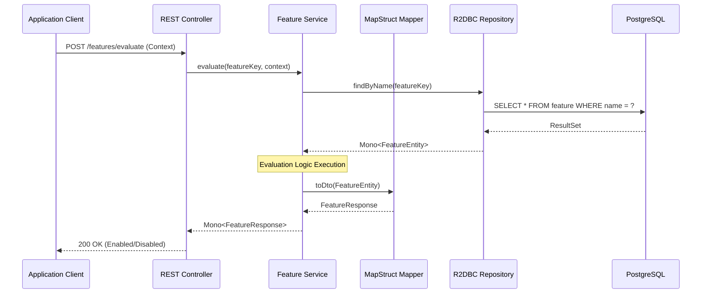

# API Request Flow Diagram

The diagram below illustrates the reactive lifecycle of a REST request within the Feature Management API.

## 🔄 Lifecycle Stages

### 1. Request Handling
The **REST Controller** receives reactive `Mono` or `Flux` requests, ensuring that evaluation threads are not blocked during I/O.

### 2. Service Layer logic
The **Feature Service** performs the core evaluation. It identifies the feature's strategy and applies context-sensitive rules (e.g., checking user IDs, JWT roles, or time windows).

### 3. Data Retrieval
Data is retrieved from **PostgreSQL** using non-blocking **R2DBC**. This allows the API to scale significantly with minimal threading overhead.

### 4. Mapping & Response
**MapStruct** converts internal database entities into clean, client-facing DTOs before the final JSON response is sent back.
