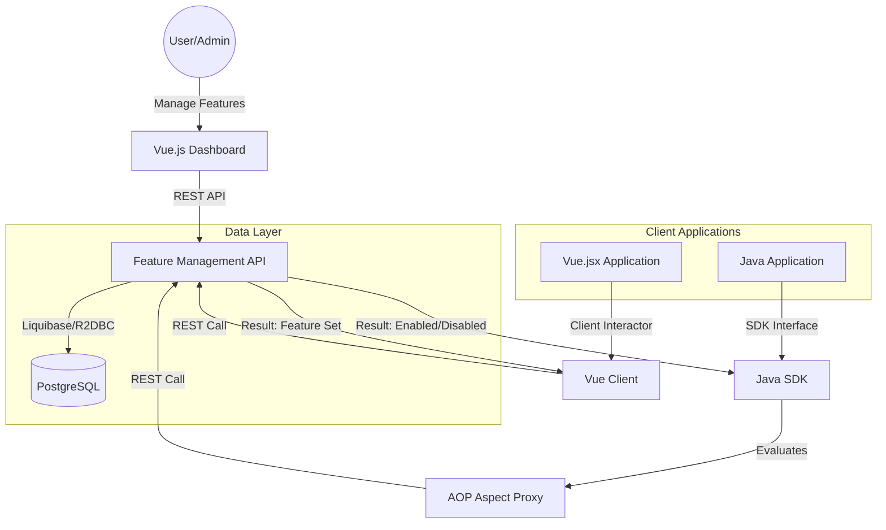

# High-Level Architecture Diagram

The diagram below illustrates the relationship between the dashboard, API, and client SDKs.

## 🔄 Interaction Flow

### 1. Feature Management
The Admin uses the **Vue.js Dashboard** to create, configure, and monitor features. All management operations are handled via a REST API on the **Feature Management API**.

### 2. Feature Evaluation
Client applications evaluate features through their respective SDKs. The **Java SDK** uses Aspect-Oriented Programming (AOP) to intercept method calls annotated with `@FeatureEnabled`, making evaluation transparent to the developer.

### 3. Data Persistence
All configurations and rules are stored in a **PostgreSQL** database. The API uses **Liquibase** for schema management and **R2DBC** for reactive data access.
