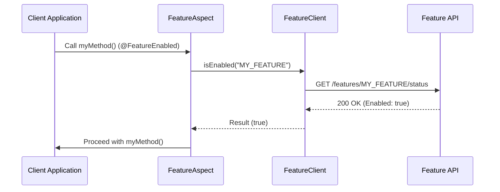

# Advanced Java SDK Concepts

Dive deeper into the SDK's internals, reactive handling, and caching.

## 🛡️ AOP Execution Flow

The `FeatureAspect` intercepts method execution using **Before** advise.



## 🧠 In-Memory Caching

To avoid high network latency for critical features, the SDK uses an internal cache (using **Caffeine**).

### Configuration
```yaml
feature:
  management:
    cache:
      enabled: true
      max-size: 1000
      ttl: 60
```

### 🏷 ETag Support
When the cache expires, the SDK sends an `If-None-Match` header to the API. If the feature hasn't changed, the API returns `304 Not Modified`, saving bandwidth and processing time.

---

## 🔄 Reactive Handling

The SDK is built from the ground up to support **Reactive Programming** with Project Reactor. All client methods return `Mono<Boolean>` or `Flux<Feature>`, ensuring that your application's request threads are never blocked.

### 🛡️ Error Handling
If the API is unreachable, the SDK provides a default **Fallback** behavior.

```java
// Fallback to disabled if the API is down
featureClient.isEnabled("MY_FEATURE")
    .onErrorReturn(false)
    .subscribe(enabled -> {
        // Application Logic
    });
```

## 📐 Context Handling

You can pass custom context (e.g., user IDs, roles) to the SDK to enable complex rule evaluation.

```java
FeatureContext context = FeatureContext.builder()
    .userId("pavan-001")
    .roles(List.of("PREMIUM"))
    .build();

featureClient.isEnabled("NEW_HEADER", context)
    .subscribe(enabled -> {
        // ...
    });
```
